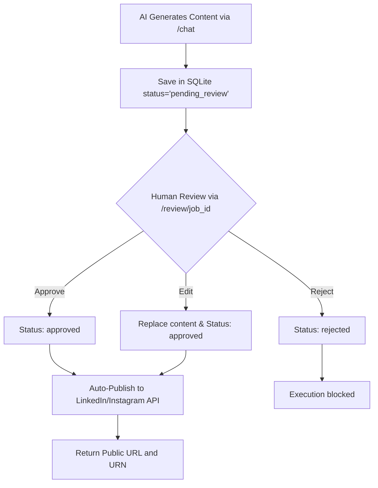

# AI Social Media Agent

A modular, production-ready AI Social Media Agent inspired by FeedHive. The application acts as a central orchestrator (Master Agent) powered by Gemini and LiteLLM, coordinating sub-agents and domain-specific services to automate content creation, A/B caption generation, publishing, scheduling, analytics, competitor analysis, and team collaboration.

---

## 🌟 Features

- **Content Generation & Repurposing:** Generate engaging posts tailored to platform conventions (LinkedIn, Instagram, Twitter, Facebook, etc.) and repurpose them seamlessly.
- **A/B Caption Variants (NEW):** Generate two distinct caption versions (Variant A for storytelling, Variant B for conversion) for A/B testing.
- **Smart Scheduling & Publishing:** Calculate optimal engagement times mathematically based on historical data.
- **LinkedIn OAuth 2.0 Authentication:** Seamless redirect flow to authenticate members and automatically save user tokens to secure storage.
- **Real LinkedIn API Integration:** Real-world connection to the LinkedIn API using member URNs and UGC post creation. Returns public post URLs directly in the API.
- **Real Instagram Graph API Integration:** Two-step container-and-publish flow via the official Instagram Graph API.
- **Human Approval Workflow:** Autonomously generate posts that are queued for human review. Approved posts are published directly to LinkedIn or Instagram.
- **SQLite Persistence (SQLAlchemy):** Full database schema configuration to store and manage scheduled publishing jobs queue permanently.
- **API Rate Limiting (slowapi):** IP-based rate limiting on the `/chat` endpoint (20 requests/minute) with HTTP 429 responses.
- **Automated Testing with Pytest:** Complete unit testing suite with mocked requests and router exception safety verification.

---

## 🛠️ Technology Stack

- **Core Language:** Python 3.10+
- **API Engine:** FastAPI (ASGI Server via Uvicorn)
- **Database ORM:** SQLAlchemy
- **Database Engine:** SQLite (Persistent database stored in `publish_jobs.db`)
- **Agent Orchestration:** LiteLLM-powered tool-calling router
- **Configuration & Validation:** Pydantic v2 & Pydantic Settings
- **HTTP Client:** Requests
- **Rate Limiting:** slowapi (starlette-compatible `limits` integration)
- **Test Framework:** Pytest

---

## 🚀 Setup Instructions

### 1. Clone & Set Up Directory
Clone this repository to your local system and navigate to the directory:
```bash
git clone <your-repository-url>
cd AI-Social-Media-Agent
```

### 2. Configure Virtual Environment
Create and activate a virtual environment to manage dependencies cleanly:
* **Windows:**
  ```powershell
  python -m venv .venv
  .venv\Scripts\activate
  ```
* **macOS/Linux:**
  ```bash
  python3 -m venv .venv
  source .venv/bin/activate
  ```

### 3. Install Dependencies
Install all required packages from `requirements.txt`:
```bash
pip install -r requirements.txt
```

### 4. Configure Environment Variables
Copy `.env.example` to `.env` and fill in your API credentials:
```bash
copy .env.example .env
```

Ensure you configure the following in your `.env` file:
```ini
# Core LLM API Key
GEMINI_API_KEY="AIzaSy..."

# LLM Selection Settings
LLM_PROVIDER="gemini"
MODEL_NAME="gemini/gemini-2.5-flash"

# LinkedIn OAuth & API Credentials
LINKEDIN_CLIENT_ID="your_client_id_here"
LINKEDIN_CLIENT_SECRET="your_client_secret_here"
LINKEDIN_ACCESS_TOKEN="your_access_token_here"

# Instagram Graph API Credentials
IG_ACCESS_TOKEN="your_instagram_access_token_here"
IG_BUSINESS_ACCOUNT_ID="your_instagram_business_account_id_here"
FACEBOOK_PAGE_ID="your_facebook_page_id_here"
```

---

## 🖥️ Running the Application

Start the FastAPI development server with reload enabled using your virtual environment:

```bash
.venv\Scripts\python.exe -m uvicorn app:app --reload --port 8001
```
The server will start running at `http://127.0.0.1:8001`. You can access the Swagger UI documentation at `http://127.0.0.1:8001/docs`.

---

## 🔗 API Endpoints Overview

| Method | Path | Description |
|--------|------|-------------|
| `POST` | `/chat` | Primary conversational agent endpoint (rate limited: 20/min) |
| `GET`  | `/jobs` | List all publishing jobs in the queue (supports `?status=pending_review`) |
| `POST` | `/review/{job_id}` | Review/approve/reject/edit pending social posts. **Approving auto-publishes the post.** |
| `POST` | `/execute_job/{job_id}`| Manually trigger the publishing of an approved job |
| `GET`  | `/linkedin/login` | Initiate LinkedIn OAuth flow |
| `GET`  | `/linkedin/callback` | LinkedIn OAuth callback & token exchange |
| `GET`  | `/health` | Health check |
| `GET`  | `/docs` | Swagger UI (OpenAPI) |

---

## 👥 Human Content Approval Workflow

All AI-generated social media posts automatically enter a `pending_review` state. Posts cannot be published until a human approves or edits them. 

### Workflow Diagram



### Testing the Workflow via Swagger UI

1. Open `http://127.0.0.1:8001/docs`.
2. Expand `POST /chat` and click **Try it out**.
3. Send a message like: `"Generate and publish a LinkedIn post about AI trends."`
4. The response will return a `job_id` and indicate the post is `pending_review`.
5. Expand `POST /review/{job_id}` and click **Try it out**.
6. Enter the `job_id` and use the action `"approve"`. 
7. The response will return `success: true` and provide the LinkedIn `publication_id` and `publication_url`!

---

## 📝 A/B Caption Variants

You can now ask the agent to generate A/B caption variants for your posts. This feature is tailored for A/B testing marketing campaigns.

**Variant A** focuses on storytelling and emotional hooks.  
**Variant B** focuses on concise, benefit-driven messaging and conversions.

### Example Request (`POST /chat`)
```json
{
  "message": "Generate A/B caption variants for a LinkedIn post about our new AI product launch. Brand: TechNova. Audience: Software Engineers. Goal: Signups. Tone: Professional."
}
```

### Example Response
```json
{
  "response": "Here are the A/B variants in JSON format:\n\n```json\n{\n  \"variant_A\": {\n    \"caption\": \"We've always believed that coding shouldn't feel like a chore... Introducing TechNova AI...\",\n    \"hashtags\": [\"#SoftwareEngineering\", \"#TechNova\"],\n    \"cta\": \"Read the full story on our blog.\"\n  },\n  \"variant_B\": {\n    \"caption\": \"Increase your team's coding velocity by 40% with TechNova AI...\",\n    \"hashtags\": [\"#Productivity\", \"#AI\"],\n    \"cta\": \"Sign up for early access today.\"\n  }\n}\n```",
  "status": "success"
}
```

---

## 🔗 LinkedIn OAuth 2.0 Integration & Setup Guide

The application includes a production-ready, real-world integration with the **LinkedIn UGC (User Generated Content) API**. 

### 1. Creating the LinkedIn Developer App
1. Go to the [LinkedIn Developer Portal](https://www.linkedin.com/developers/) and log in.
2. Click **Create App** and fill in the details.
3. Under the **Products** tab, request access to:
   - **Share on LinkedIn** (grants the `w_member_social` permission).
   - **Sign In with LinkedIn** (used to retrieve member ID).
4. Configure redirect URIs in the **Auth** tab of your app to match:
   `http://127.0.0.1:8001/linkedin/callback`

### 2. Live OAuth Code Flow
1. Navigate to `http://127.0.0.1:8001/linkedin/login` in your browser.
2. Grant permissions in the LinkedIn authorization dialog.
3. The server callback at `/linkedin/callback` will exchange the authorization code for a User Access Token, save it into your `.env` file automatically, and update the application memory state.

---

## 🚦 API Rate Limiting

The `/chat` endpoint is protected by IP-based rate limiting powered by **slowapi**.

| Endpoint | Limit | Window |
|----------|-------|--------|
| `POST /chat` | 20 requests | per minute per IP |

When the limit is exceeded, the API responds with **HTTP 429 Too Many Requests**. This does not affect the Swagger UI (`/docs`) or any other endpoint.

---

## 🧪 Running Tests

Ensure your virtual environment is active and run `pytest` to execute all unit tests:

```bash
.venv\Scripts\python -m pytest -v
```

All 21 integration and unit tests currently pass, fully validating the rate limiters, publishing queues, the LLM router, and the human approval workflow.
